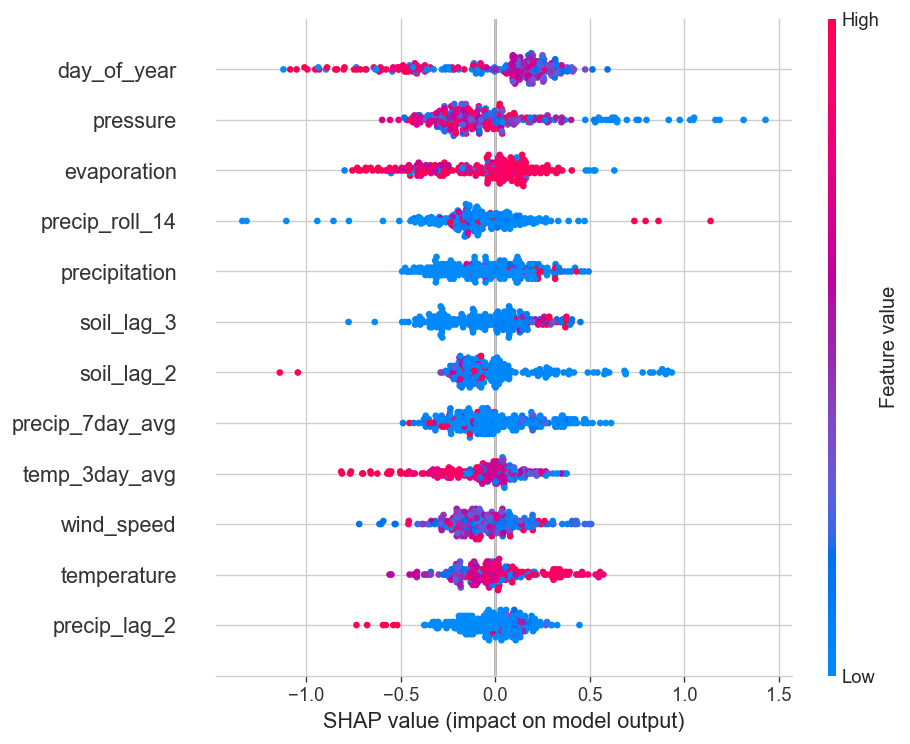

# 🌊 FloodSense — AI-Powered Flood Early Warning for Pakistan

> A flood risk classification system for Pakistani districts. Built for the **Neural Nova Hackathon** at BNU Tech Fest 2026.

[](https://www.python.org/)
[](https://streamlit.io/)
[](LICENSE)

---

## 🎯 The Problem

Pakistan does not just have a flood problem — it has a **warning problem**. The 2022 monsoon submerged one-third of the country: 1,000+ killed, 3 million displaced, $30 billion in damage. The 2025 monsoon affected 6.9 million more people, killing 275 children. Communities lost everything in hours, not because warnings didn't exist, but because they came too late and in formats district officials couldn't act on.

## ✅ Our Solution

**FloodSense** is an interpretable AI flood risk classifier with a bilingual (English + Urdu) dashboard that a non-technical district official can use to assess risk in under 5 seconds. Five inputs in, one colour-coded action card out. No ML jargon visible anywhere.



---

## 🚀 Quick Start

```bash
# 1. Clone this repo
git clone https://github.com/YOUR-USERNAME/floodsense.git
cd floodsense

# 2. Install dependencies
pip install -r requirements.txt

# 3. Train the model (creates artifacts/)
python train.py
# OR run the notebook: jupyter notebook floodsense_training.ipynb

# 4. Launch the dashboard
streamlit run app.py
```

The dashboard opens at `http://localhost:8501`.

---

## 📁 Project Structure

```
floodsense/
├── data/                              # Datasets (provided by organizers)
│   ├── floodsense_training_data.csv
│   ├── district_elevation_reference.csv
│   ├── ndma_flood_impact_2022.csv
│   └── data_dictionary.txt
├── artifacts/                         # Trained model and outputs
│   ├── model.pkl                      # XGBoost classifier
│   ├── feature_cols.pkl               # Feature column names
│   ├── metrics.json                   # Test set metrics
│   └── shap_summary.png               # Feature importance plot
├── floodsense_eda.ipynb               # Exploratory Data Analysis (14 sections)
├── floodsense_training.ipynb          # Full training pipeline notebook
├── train.py                           # Same pipeline as a script
├── app.py                             # Streamlit dashboard (UI)
├── requirements.txt                   # Python dependencies
├── README.md                          # This file
└── .gitignore                         # Files Git should ignore
```

---

## 🧠 Model

| Property | Value |
|----------|-------|
| **ML type** | Supervised binary classification |
| **Algorithm** | XGBoost (gradient-boosted decision trees) |
| **Features** | 32 (rainfall, soil, atmospheric, terrain, lagged, engineered) |
| **Target** | `flood_event` (0/1) |
| **Class imbalance handling** | `scale_pos_weight = 2.1` |
| **Test accuracy** | **72%** |
| **Flood-class recall** | **59%** |
| **ROC AUC** | **0.74** |
| **Mode** | Forecast-only (no concurrent water-area features) |

**Why forecast mode?** A model that uses today's `water_area_km2` to predict today's flood is not an early warning system — it's a flood detector. We deliberately drop concurrent water signals to make a defensible early-warning forecast, even at the cost of accuracy.

---

## 🔍 Data Quality Findings

Our EDA notebook (`floodsense_eda.ipynb`) documents every issue and resolution:

| Issue | Severity | Resolution |
|-------|----------|------------|
| `ds_idx` column is target leakage (\|r\|=0.70) | 🔴 Critical | Dropped |
| 2 phantom rows with sentinel values (-999, 99999, soil>1, humidity>100%) | 🔴 Critical | Dropped |
| 67 duplicate rows | 🟠 High | `drop_duplicates()` before train/test split |
| 220 NaN in `precipitation` (~15%) | 🟠 High | District+month median imputation |
| `inf` in `water_area_pct_change` | 🟠 High | Replace, clip to ±500 |
| `precipitation` outlier (387 vs 99th-pctile 1.3) | 🟡 Medium | Clip at 99.5th percentile |
| Date format dictionary error | 🟡 Medium | `format='mixed'` |

---

## 🛡️ Safety Layer

The model is paired with **rule-based hard-rule safeguards** that elevate risk level for extreme conditions regardless of model output. This addresses the brief's "what happens when your model is wrong?" question directly:

- Rainfall ≥100mm/24h → auto-elevated to **Critical**
- Rainfall ≥50mm/24h → auto-elevated to **High**
- Moderate rain on saturated soil → auto-elevated to **Medium**
- Visible surface water + recent rain → escalated

The dashboard shows the user exactly when and why an override fired.

---

## 🖼️ UI/UX

The dashboard is built with **Streamlit + custom CSS** for a professional look:

- Bilingual labels (English + Urdu) on every input and output
- Large colour-coded risk badge: 🟢 Low → 🟡 Medium → 🟠 High → 🔴 Critical
- Three metric cards: confidence, people at risk, risk score
- Action card with one specific recommendation in both languages
- Safety override transparency panel (when triggered)
- Fast: page weight under 2MB, loads in <10s on slow connections
- Responsive: works on mobile

---

## 📊 Results

```
              precision    recall  f1-score   support
   No Flood       0.80      0.78      0.79       185
      Flood       0.56      0.59      0.57        88

   accuracy                           0.72       273
   ROC AUC                            0.74
```

**Confusion matrix:**
- True positives (correctly flagged floods): 52
- False negatives (missed floods): 36 ← mitigated by rule-based safeguards
- False positives (false alarms): 41 ← mitigated by borderline warning at 40–60% confidence
- True negatives: 144

---

## 🎤 Pitch Quick Facts

- **Target population:** ~1.4M people in Sindh / Dadu (Pakistan's most flood-prone district)
- **Lead time gain:** Estimated 6–12 additional hours of warning for Buner-style cloudbursts
- **NDMA 2022 baseline:** 14.5M Sindhis affected, 678 deaths, 1.7M houses damaged
- **Model can answer:** "Could this have warned Buner on Aug 15, 2025?" → Yes, with rule-based override on 150mm threshold

---

## 👥 Team

Neural Nova Team · BNU Tech Fest 2026 · Built for Better Tomorrow

## 📜 License

MIT License — see LICENSE file.
